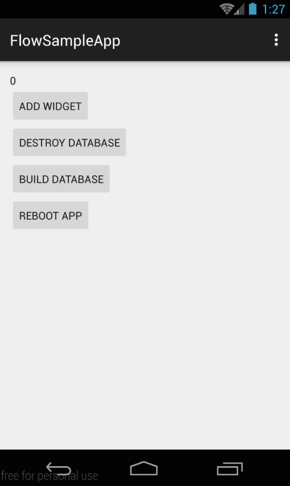
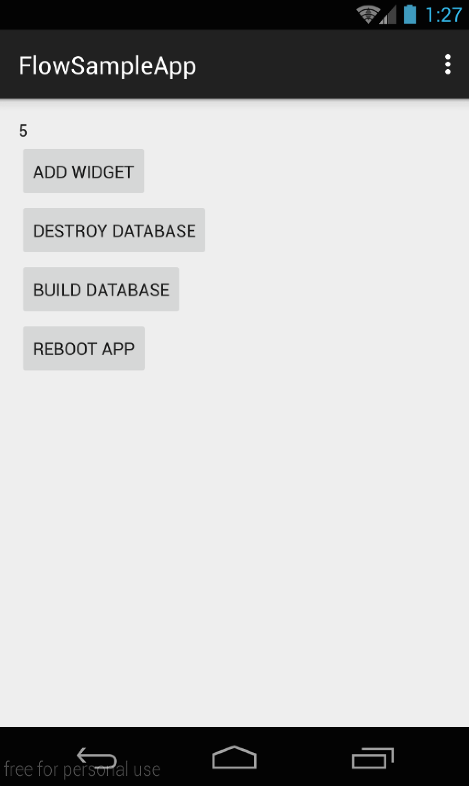
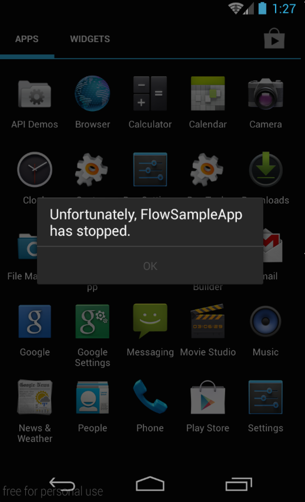

# DBFlow Sample App

This is the repository of to demonstrate how DBFlow works and possibly show bugs.



### SQLiteDiskIOException after destroying database

After using `FlowManager.destroy();` and `context.getDatabasePath(databaseName);` (in that order), `FlowManager` should have let go of any references to the database and we show now be able to call `FlowManager.init(context);` and proceed to insert to and query database again.

On attempting to insert after taking these step the following exception is thrown:

``` java
06-07 01:31:59.082    4214-4214/io.kaeawc.flow.app E/AndroidRuntime﹕ FATAL EXCEPTION: main
    android.database.sqlite.SQLiteDiskIOException: disk I/O error (code 1802)
            at android.database.sqlite.SQLiteConnection.nativeExecuteForLastInsertedRowId(Native Method)
            at android.database.sqlite.SQLiteConnection.executeForLastInsertedRowId(SQLiteConnection.java:775)
            at android.database.sqlite.SQLiteSession.executeForLastInsertedRowId(SQLiteSession.java:788)
            at android.database.sqlite.SQLiteStatement.executeInsert(SQLiteStatement.java:86)
            at com.raizlabs.android.dbflow.sql.SqlUtils.insert(SqlUtils.java:282)
            at com.raizlabs.android.dbflow.sql.SqlUtils.save(SqlUtils.java:234)
            at com.raizlabs.android.dbflow.structure.ModelAdapter.save(ModelAdapter.java:54)
            at com.raizlabs.android.dbflow.structure.BaseModel.save(BaseModel.java:54)
            at io.kaeawc.flow.app.ui.MainActivityFragment$1.onClick(MainActivityFragment.java:70)
            at android.view.View.performClick(View.java:4204)
            at android.view.View$PerformClick.run(View.java:17355)
            at android.os.Handler.handleCallback(Handler.java:725)
            at android.os.Handler.dispatchMessage(Handler.java:92)
            at android.os.Looper.loop(Looper.java:137)
            at android.app.ActivityThread.main(ActivityThread.java:5041)
            at java.lang.reflect.Method.invokeNative(Native Method)
            at java.lang.reflect.Method.invoke(Method.java:511)
            at com.android.internal.os.ZygoteInit$MethodAndArgsCaller.run(ZygoteInit.java:793)
            at com.android.internal.os.ZygoteInit.main(ZygoteInit.java:560)
            at dalvik.system.NativeStart.main(Native Method)
```

To reproduce:

Create some models.



Delete the database.
Create a new model.


